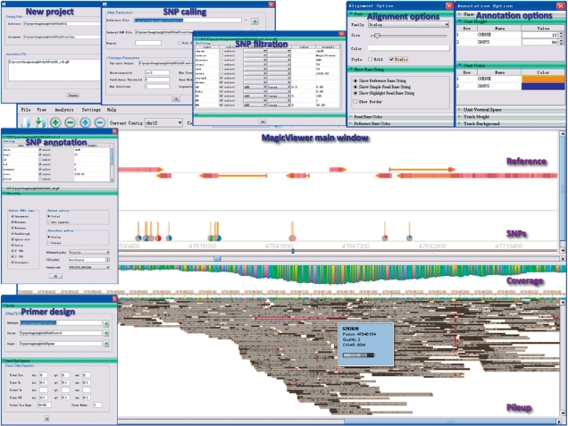

### Introduction To JavaScript

This is the source code of MagicViewer

Abstract:
New sequencing technologies, such as Roche 454, ABI SOLiD and Illumina, have been increasingly developed at an astounding pace with the advantages of high throughput, reduced time and cost. To satisfy the impending need for deciphering the large-scale data generated from next-generation sequencing, an integrated software MagicViewer is developed to easily visualize short read mapping, identify and annotate genetic variation based on the reference genome. MagicViewer provides a user-friendly environment in which large-scale short reads can be displayed in a zoomable interface under user-defined color scheme through an operating system-independent manner. Meanwhile, it also holds a versatile computational pipeline for genetic variation detection, filtration, annotation and visualization, providing details of search option, functional classification, subset selection, sequence association and primer design. In conclusion, MagicViewer is a sophisticated assembly visualization and genetic variation annotation tool for next-generation sequencing data, which can be widely used in a variety of sequencing-based researches, including genome re-sequencing and transcriptome studies.

